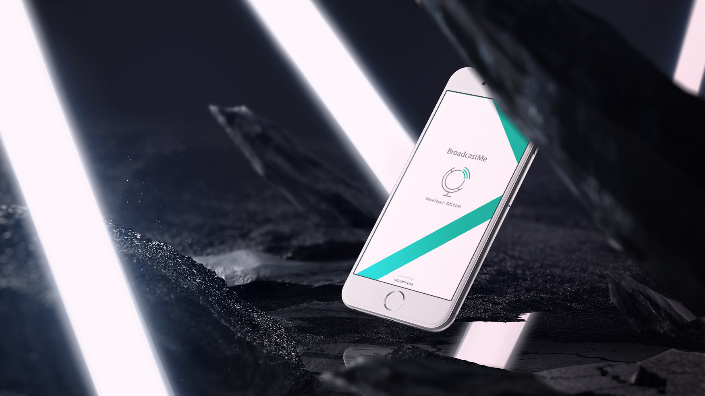

# 

## Introduction
[Streamaxia Open Player](https://www.streamaxia.com/openplayer-rtmp-player-android/) is an easy to integrate, low-latency live video streaming player for Android mobile apps. Open live video broadcast – not limited to any specific CDN, RTMP Media Server or proprietary protocols. Drag, Drop & play your live streams.

This is a short programming guide about how to test Streamaxia Open Player using our demo Android project.

[Try and order Streamaxia Open Player today!](https://www.streamaxia.com/opensdk-pricing/)

## Android Demo Project Installation:

- Clone the repository on your computer
- Inside ChooserActivity.java set your desired stream URLs
```
// Modify this to your desired streams
public static final String RTMP_URL = "";
public static final String HLS_URL = "";
public static final String DASH_URL = "";
```
Build and run the project.
For more information about the Streamaxia Open Player set up please check [Streamaxia Android Open Player Setup Guide](files/OpenSDK_Android.pdf)

## Terms
By using this software, you agree the terms specified in the Licensing Agreement represented by the [License Agreement](https://www.streamaxia.com/licensing-agreement/)


## Help and Support

- Mo-Fri 9AM-5PM EET

- support@streamaxia.com

## Resources

- [Streamaxia site](https://www.streamaxia.com/)

- [Streamaxia Android Open Player Setup Guide](files/OpenSDK_Android.pdf)

- [BroadcastMe App page](https://www.streamaxia.com/broadcastme-whitelabel-app/)

- [BroadcastMe iOS App](https://itunes.apple.com/us/app/broadcast-me/id491982406)

- [BroadcastMe Android App](https://play.google.com/store/apps/details?id=com.streamaxia.broadcastme)

- [Streamaxia Blog](https://medium.com/streamaxia)


<!-- display the social media buttons in your README -->

[![alt text][1.1]][1]
[![alt text][2.1]][2]
[![alt text][6.1]][6]


<!-- links to social media icons -->
<!-- no need to change these -->

<!-- icons with padding -->

[1.1]: http://i.imgur.com/tXSoThF.png (twitter icon with padding)
[2.1]: http://i.imgur.com/P3YfQoD.png (facebook icon with padding)
[6.1]: http://i.imgur.com/0o48UoR.png (github icon with padding)

<!-- icons without padding -->

[1.2]: http://i.imgur.com/wWzX9uB.png (twitter icon without padding)
[2.2]: http://i.imgur.com/fep1WsG.png (facebook icon without padding)
[6.2]: http://i.imgur.com/9I6NRUm.png (github icon without padding)


<!-- links to your social media accounts -->
<!-- update these accordingly -->

[1]: https://twitter.com/streamaxia
[2]: https://facebook.com/streamaxia
[6]: http://www.github.com/streamaxia
